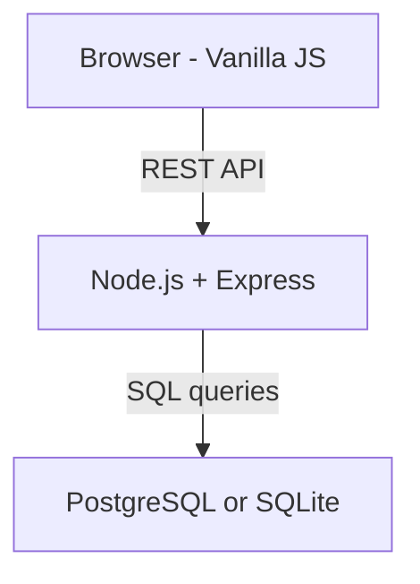
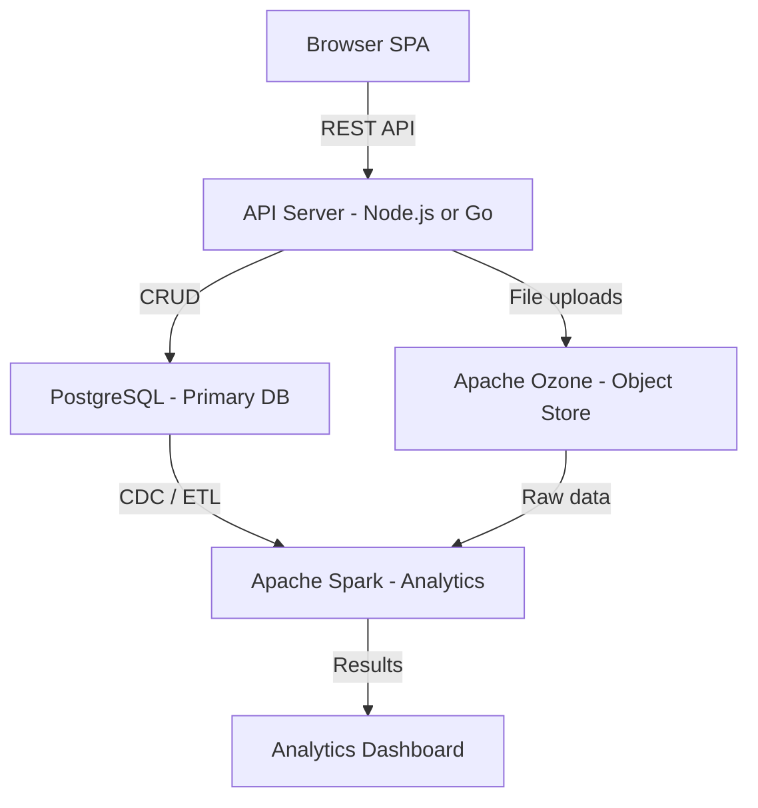

# Architecture Review: Task Manager App

## Current State
- **Runtime:** Node.js + Express
- **Frontend:** Vanilla JS + HTML/CSS
- **Storage:** In-memory array (no persistence)
- **Pattern:** Simple CRUD REST API

---

## Your Suggestions & Analysis

### 1. Apache Ozone for Data Layer

Apache Ozone is a **distributed object store** designed for big data workloads in the Hadoop ecosystem. It stores massive volumes of unstructured data — files and blobs — at petabyte scale.

**Mismatch with current app:**
- This app stores structured records with fields like title, done, createdAt
- Ozone has no query engine, no indexing, no transactions
- Every read/write would require serializing/deserializing JSON blobs
- Ozone requires significant infrastructure: SCM, OM, DataNodes

**Better fits for structured task data:**
- **PostgreSQL** — robust, relational, excellent for CRUD
- **SQLite** — zero-config, embedded, great for small-to-medium apps
- **MongoDB** — document store if you want flexible schemas

**When Ozone WOULD make sense:** If the app evolves to store large file attachments, logs, or analytics data alongside tasks.

### 2. Apache Spark Instead of Hand-Made MapReduce

The current app has **no MapReduce logic** — it performs single-record CRUD operations using array methods like `find`, `push`, and `splice`.

Apache Spark is a distributed computing engine for processing terabytes of data across clusters.

**Mismatch with current app:**
- No batch processing or analytics workload exists
- Spark requires JVM, a cluster manager, and executor nodes
- Massive infrastructure overhead for simple record lookups

**When Spark WOULD make sense:** If you need to run analytics across millions of tasks — aggregations, trend analysis, reporting dashboards, ML pipelines.

### 3. Is Node.js the Best Runtime Choice?

| Runtime | Performance | Concurrency | Ecosystem | Dev Speed | Best For |
|---------|------------|-------------|-----------|-----------|----------|
| **Node.js** | Good | Excellent async I/O | Huge | Fast | I/O-heavy web APIs |
| **Go** | Very Good | Excellent goroutines | Growing | Medium | High-perf microservices |
| **Rust** | Best | Excellent | Smaller | Slow | Max performance, safety |
| **Python/FastAPI** | Moderate | Good async | Huge | Fast | Rapid prototyping, ML |
| **Java/Spring** | Good | Thread pools | Massive | Slow | Enterprise apps |

**Verdict:** Node.js is a solid choice for this type of web API. The performance bottleneck will be the database, not the runtime. If you need to squeeze out more performance later, **Go** is the most practical upgrade path.

---

## Recommended Architecture

For a task manager that is production-ready but right-sized:

### If You Want to Scale to Big Data

If the goal is to learn or use Ozone + Spark, the app scope needs to grow:

In this model:
- **PostgreSQL** handles real-time CRUD
- **Ozone** stores file attachments and raw event logs
- **Spark** runs batch analytics and reporting jobs

---

## Open Questions

1. What scale are you targeting — hundreds or millions of users?
2. Is there a big-data or analytics component motivating Ozone + Spark?
3. Is this a learning exercise for those specific technologies?
4. Do you want to keep the frontend as vanilla JS or adopt a framework?
