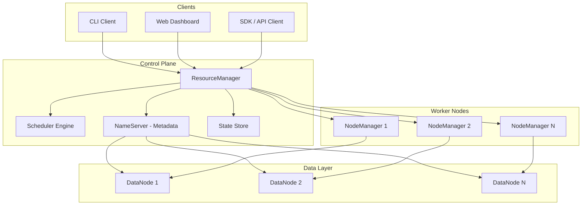
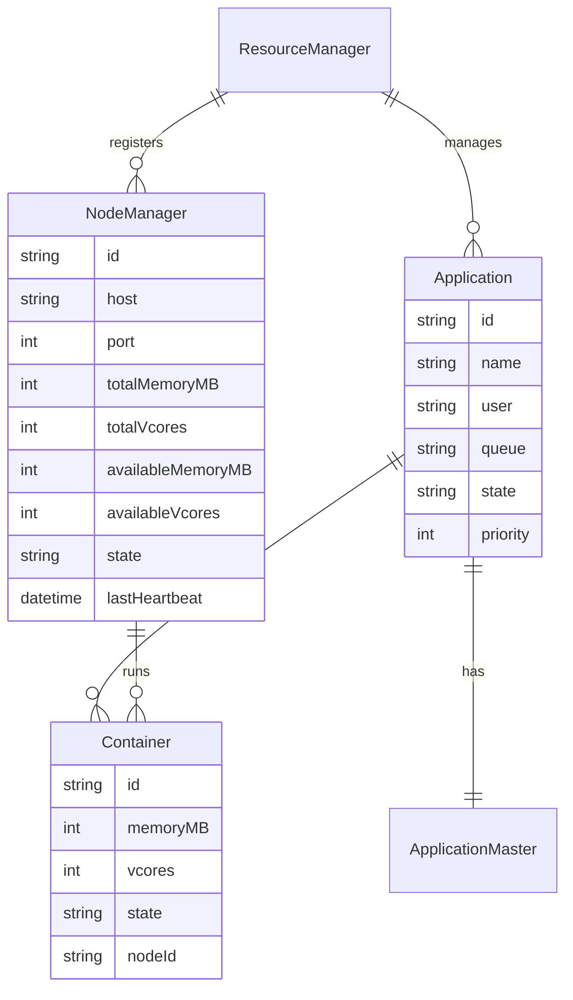
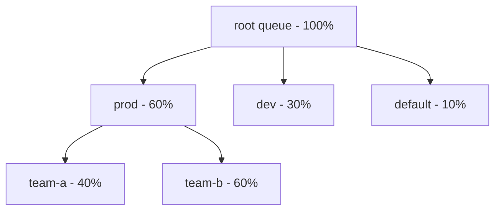
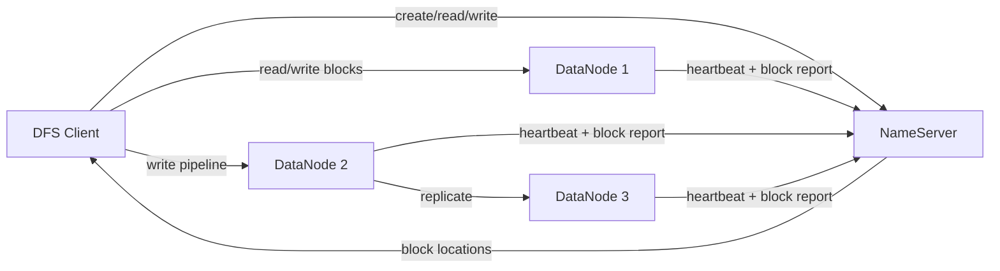
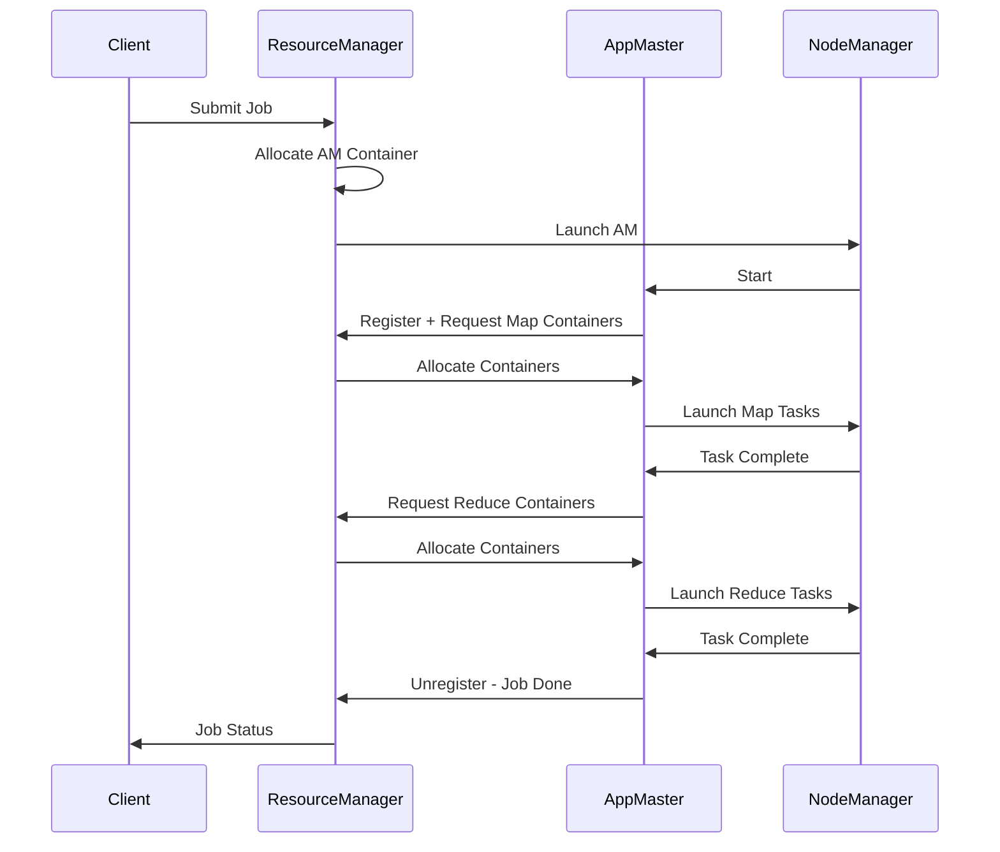

# Distributed Compute Framework — Architecture Plan

## Overview

Transform the current simple task manager into a distributed compute framework inspired by Hadoop/YARN. The system will provide resource management, job scheduling, distributed data storage, fault tolerance, and a pluggable programming model.

**Language/Runtime:** Node.js + TypeScript  
**Communication:** gRPC for inter-service RPC, REST for management APIs  
**Storage:** Custom block-based distributed file system  
**Coordination:** ZooKeeper-like coordination service (or etcd)

---

## High-Level Architecture



---

## Phase 1 — Core Resource Management

Build the foundational YARN-like resource management layer.

### Components

#### ResourceManager - RM
- Global singleton that tracks cluster resources
- Accepts application submissions
- Delegates scheduling decisions to pluggable Scheduler
- Maintains node registry via heartbeats
- Exposes REST API for management and monitoring

#### NodeManager - NM
- Per-node agent process
- Reports available resources via heartbeats: memory, CPU vcores, custom resources
- Launches and monitors containers
- Streams container logs
- Health checking: periodic self-checks, reports status to RM

#### Container
- Fundamental allocation unit
- Defined by: memory MB, CPU vcores, optional custom resources
- Lifecycle: REQUESTED -> ALLOCATED -> RUNNING -> COMPLETED/FAILED/KILLED
- Isolation via process-level controls initially, cgroups later

#### ApplicationMaster - AM
- Per-application process that negotiates resources with RM
- Manages task lifecycle within the application
- Runs as a container itself
- Framework-specific logic lives here

### Data Model



---

## Phase 2 — Job Scheduling

### Scheduler Types

1. **FIFO Scheduler** — Simple queue, first-come-first-served
2. **Capacity Scheduler** — Hierarchical queues with guaranteed capacity percentages
3. **Fair Scheduler** — Equal resource distribution across running apps

### Queue Model



### Key Features
- Pluggable scheduler interface
- Queue hierarchy with capacity guarantees
- Elastic sharing of idle capacity
- Application priorities
- Per-queue and per-user limits
- Preemption support

---

## Phase 3 — Distributed File System - DFS

A simplified HDFS-like block storage system.

### Components

#### NameServer
- Manages filesystem namespace: directory tree + file metadata
- Tracks block-to-node mapping
- Handles replication decisions
- Persists metadata to edit log + periodic checkpoints

#### DataNode
- Stores actual data blocks on local disk
- Sends heartbeats and block reports to NameServer
- Serves read/write requests from clients
- Verifies block checksums

### Design



### Key Features
- Block-based storage with configurable block size - default 128MB
- Replication factor - default 3
- Write pipeline for replication
- Block checksumming
- Rack awareness - pluggable topology

---

## Phase 4 — Programming Model

### MapReduce Engine
- Map phase: user function processes input splits into key-value pairs
- Shuffle and sort: automatic partitioning and transfer
- Reduce phase: user function aggregates by key
- Combiner support for local pre-aggregation
- Pluggable InputFormat/OutputFormat

### Task Execution Flow



---

## Phase 5 — Fault Tolerance

- **Task retries** — configurable max attempts per task
- **Speculative execution** — duplicate slow tasks
- **Heartbeat monitoring** — detect dead nodes, reschedule work
- **AM recovery** — restart failed ApplicationMasters
- **Block re-replication** — detect under-replicated blocks, trigger copies
- **Checksumming** — verify data integrity on read/write

---

## Phase 6 — Multi-Tenancy and Security

- Queue ACLs
- User authentication - token-based
- Per-queue resource limits
- User quotas on DFS
- Container isolation improvements

---

## Phase 7 — High Availability and Federation

- RM Active/Standby with state store
- NameServer HA with journal-based replication
- YARN Federation for multi-cluster
- DFS Federation for namespace scaling

---

## Phase 8 — Monitoring, Management, and Ecosystem

- Web dashboard for RM, NM, NameServer
- REST APIs for all components
- Metrics collection and export
- CLI tools for administration
- Plugin system for ecosystem integration

---

## Technology Choices

| Concern | Choice | Rationale |
|---------|--------|-----------|
| Language | TypeScript / Node.js | Existing codebase, async I/O, rapid prototyping |
| Inter-service RPC | gRPC with protobuf | Efficient binary protocol, streaming support, code generation |
| REST APIs | Express.js | Already in use, good for management endpoints |
| State Store | SQLite initially, etcd later | Simple persistence first, distributed coordination later |
| Container Isolation | Child processes initially, cgroups later | Progressive complexity |
| Configuration | YAML files | Human-readable, hierarchical |
| Testing | Jest + integration tests | Standard Node.js testing |
| Monorepo | npm workspaces | Keep all packages in one repo |

---

## Project Structure - Target

```
/
├── packages/
│   ├── common/           # Shared types, utils, protobuf definitions
│   ├── resource-manager/ # ResourceManager service
│   ├── node-manager/     # NodeManager agent
│   ├── scheduler/        # Pluggable scheduler implementations
│   ├── app-master/       # ApplicationMaster framework
│   ├── nameserver/       # DFS NameServer
│   ├── datanode/         # DFS DataNode
│   ├── dfs-client/       # DFS client library
│   ├── mapreduce/        # MapReduce engine
│   ├── cli/              # Command-line tools
│   └── dashboard/        # Web UI
├── proto/                # Protocol buffer definitions
├── config/               # Default configuration files
├── plans/                # Architecture docs
└── package.json          # Root workspace config
```
