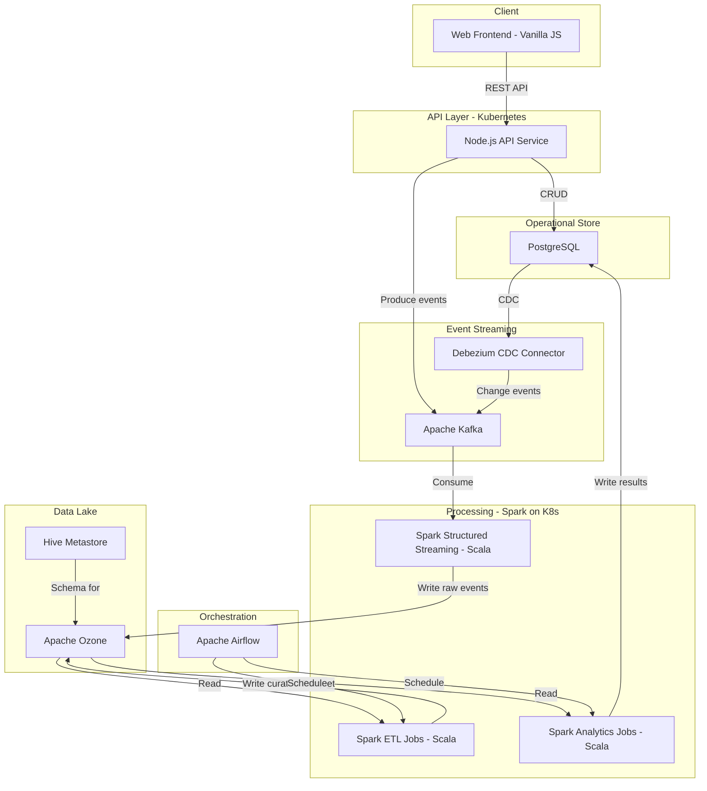
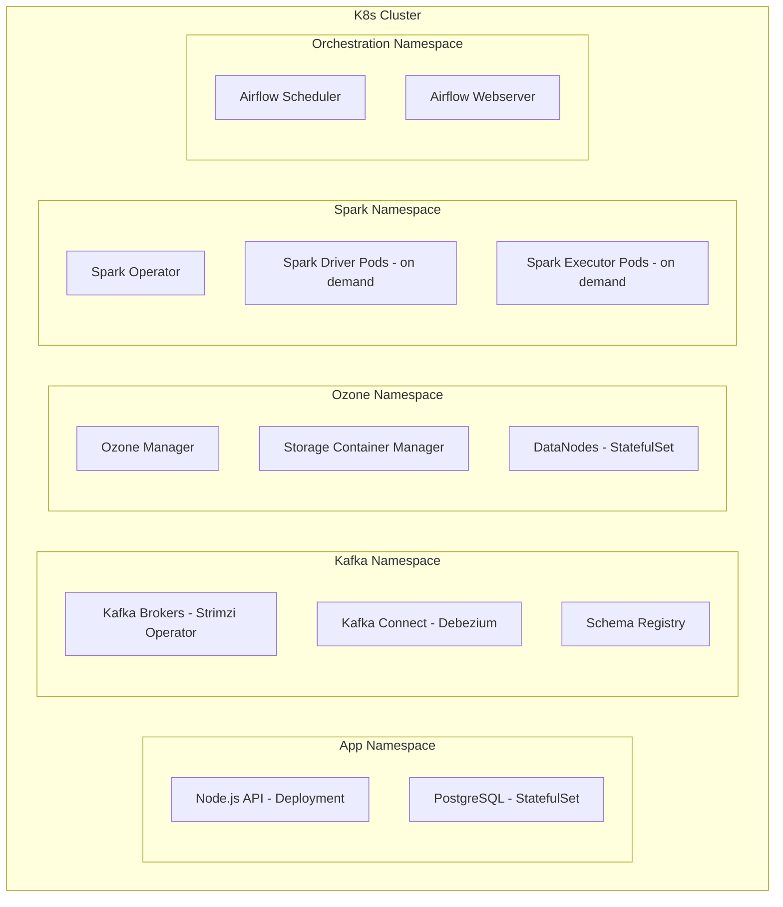

# Big Data Architecture Plan: Modern Hadoop Stack

## Context
This task manager is part of a larger big-data system capable of handling petabytes of data, built on a modern Hadoop ecosystem.

---

## Finalized Technology Stack

| Layer | Technology | Notes |
|-------|-----------|-------|
| Frontend | Vanilla JS or React | Not a priority — keep current vanilla JS |
| API | Node.js + Express/Fastify | Real-time CRUD, event emission |
| Operational DB | PostgreSQL | Transactional data, low-latency queries |
| Message Queue | Apache Kafka | Event streaming between real-time and batch paths |
| Object Store | Apache Ozone | Petabyte-scale data lake, S3-compatible |
| Processing | Apache Spark in Scala | ETL, analytics, streaming, ML |
| Metadata | Apache Hive Metastore | Schema management for Ozone data |
| CDC | Debezium | PostgreSQL change data capture to Kafka |
| Orchestration | Apache Airflow | Spark job scheduling |
| Infrastructure | Kubernetes | Container orchestration, Spark on K8s |

---

## Architecture Overview



---

## Data Flow Detail

### Real-time Path
1. User performs CRUD action via the web frontend
2. Node.js API writes to PostgreSQL for immediate consistency
3. Node.js API produces an event to Kafka topic `task-events`
4. Debezium captures PostgreSQL changes and publishes to Kafka topic `task-cdc`

### Streaming Path
5. Spark Structured Streaming job consumes from Kafka topics
6. Raw events are written to Ozone in JSON/Avro format
7. Bucket: `raw-events`, Key pattern: `/task-events/year/month/day/hour/`

### Batch ETL Path
8. Airflow triggers Spark ETL job on schedule
9. ETL reads raw JSON/Avro from Ozone, transforms to Parquet with schema evolution
10. Curated data written to Ozone bucket: `curated-data`, partitioned by date
11. Hive Metastore registers table metadata for SQL access

### Analytics Path
12. Airflow triggers Spark analytics jobs
13. Analytics reads curated Parquet from Ozone
14. Computes aggregations: task completion rates, user productivity, SLA metrics
15. Results written back to PostgreSQL for dashboard queries

---

## Ozone Bucket and Key Schema

```
ozone-volume/
  raw-events/                          # Bucket: raw ingested data
    task-events/
      year=2026/month=02/day=16/
        hour=07/
          events-00001.avro
          events-00002.avro
    task-cdc/
      year=2026/month=02/day=16/
        changes-00001.avro

  curated-data/                        # Bucket: ETL-processed data
    tasks/
      year=2026/month=02/day=16/
        part-00000.parquet
        part-00001.parquet
    user-metrics/
      year=2026/month=02/
        part-00000.parquet

  analytics-output/                    # Bucket: aggregated results
    daily-summary/
      date=2026-02-16/
        summary.parquet
    sla-compliance/
      date=2026-02-16/
        compliance.parquet

  attachments/                         # Bucket: binary file storage
    task-id/
      filename.ext
```

---

## Spark Job Specifications

All Spark jobs written in **Scala**, running on **Spark on Kubernetes**.

### Job 1: Streaming Ingestion
- **Type:** Spark Structured Streaming
- **Source:** Kafka topics - task-events, task-cdc
- **Sink:** Ozone raw-events bucket in Avro format
- **Trigger:** Continuous, micro-batch every 1 minute
- **Checkpointing:** Ozone checkpoint bucket

### Job 2: ETL - Raw to Curated
- **Type:** Batch
- **Schedule:** Hourly via Airflow
- **Source:** Ozone raw-events bucket
- **Transform:** Deduplicate, validate schema, convert to Parquet, partition by date
- **Sink:** Ozone curated-data bucket
- **Schema:** Managed by Hive Metastore

### Job 3: Analytics Aggregation
- **Type:** Batch
- **Schedule:** Daily via Airflow
- **Source:** Ozone curated-data bucket
- **Computations:**
  - Task completion rates by user/team/day
  - Average task lifetime from creation to completion
  - SLA compliance percentages
  - Trend analysis over rolling windows
- **Sink:** PostgreSQL analytics tables + Ozone analytics-output bucket

### Job 4: ML Pipeline - optional future
- **Type:** Batch
- **Source:** Ozone curated-data bucket
- **Model:** Task priority prediction, workload forecasting
- **Sink:** Model artifacts to Ozone, predictions to PostgreSQL

---

## API Layer Changes

### Current: Simple in-memory CRUD
### Target: Dual-write with event emission

```
POST /api/tasks
  1. Validate input
  2. Write to PostgreSQL
  3. Produce event to Kafka topic task-events
  4. Return response

PATCH /api/tasks/:id
  1. Validate input
  2. Update PostgreSQL
  3. Produce event to Kafka topic task-events
  4. Return response

DELETE /api/tasks/:id
  1. Delete from PostgreSQL
  2. Produce event to Kafka topic task-events
  3. Return 204

GET /api/tasks
  1. Query PostgreSQL
  2. Return results

GET /api/analytics/summary
  1. Query PostgreSQL analytics tables - populated by Spark
  2. Return aggregated metrics
```

### New Dependencies for Node.js API
- `kafkajs` — Kafka producer
- `pg` — PostgreSQL client
- `@aws-sdk/client-s3` — Ozone access via S3 API for file attachments

---

## Kubernetes Deployment



### Key K8s Components
- **Strimzi** for Kafka on Kubernetes
- **Spark Operator** for managing Spark applications on K8s
- **Ozone** deployed as StatefulSets with persistent volumes
- **Airflow** with KubernetesExecutor for Spark job submission

---

## Implementation Phases

### Phase 1: Foundation
- Set up PostgreSQL and migrate from in-memory storage
- Add Kafka producer to Node.js API
- Deploy Kafka cluster with Strimzi on K8s
- Set up Debezium CDC connector

### Phase 2: Data Lake
- Deploy Apache Ozone cluster on K8s
- Configure Ozone buckets and volume
- Implement Spark Structured Streaming job for Kafka to Ozone ingestion
- Set up Hive Metastore

### Phase 3: Processing Pipeline
- Implement Spark ETL job - raw to curated Parquet
- Implement Spark analytics job - aggregations and metrics
- Deploy Airflow for job scheduling
- Add analytics API endpoints to Node.js service

### Phase 4: Production Hardening
- Add monitoring - Prometheus, Grafana for all components
- Implement security - TLS, authentication, authorization
- Set up backup and disaster recovery for Ozone and PostgreSQL
- Performance tuning and load testing
- CI/CD pipelines for Spark jobs and API service
