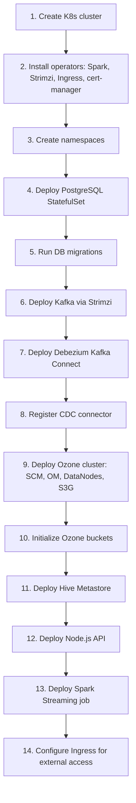

# Remote Deployment Requirements — Phase 1 & 2

## Overview

Running Phase 1 (API + PostgreSQL + Kafka + Debezium) and Phase 2 (Ozone + Spark + Hive Metastore) remotely requires a Kubernetes cluster with sufficient resources and supporting infrastructure.

---

## Option A: Managed Kubernetes (Recommended)

### Cloud Provider Options
- **AWS EKS** — Amazon Elastic Kubernetes Service
- **GCP GKE** — Google Kubernetes Engine
- **Azure AKS** — Azure Kubernetes Service

### Minimum Cluster Requirements

| Resource | Specification | Notes |
|----------|--------------|-------|
| Kubernetes version | 1.27+ | Required for Spark Operator CRDs |
| Worker nodes | 5-7 nodes | Spread across availability zones |
| Node instance type | 4 vCPU, 16 GB RAM each | e.g., AWS m5.xlarge, GCP e2-standard-4 |
| Total cluster CPU | 20-28 vCPU | Across all worker nodes |
| Total cluster RAM | 80-112 GB | Across all worker nodes |
| Storage class | SSD-backed PVs | For PostgreSQL, Ozone metadata |
| Persistent storage | ~500 GB total | See breakdown below |
| Container registry | ECR, GCR, or ACR | For pushing Docker images |
| Load balancer | Cloud LB or Ingress controller | For external API access |

### Storage Breakdown

| Component | Storage | Type |
|-----------|---------|------|
| PostgreSQL | 10-50 GB | SSD PV |
| Ozone SCM metadata | 20 GB | SSD PV |
| Ozone OM metadata | 20 GB | SSD PV |
| Ozone DataNodes x3 | 100 GB each = 300 GB | Standard PV (expandable) |
| Kafka logs | 50 GB | Standard PV |
| **Total** | **~450 GB** | |

---

## Option B: Self-Managed Kubernetes (e.g., bare metal, VMs)

### Server Requirements

| Role | Count | CPU | RAM | Disk | Purpose |
|------|-------|-----|-----|------|---------|
| K8s Control Plane | 3 | 2 vCPU | 4 GB | 50 GB SSD | etcd, API server, scheduler |
| Worker Node | 5-7 | 4 vCPU | 16 GB | 200 GB SSD | Workloads |
| **Total** | **8-10** | **26-34 vCPU** | **92-124 GB** | **1.1-1.5 TB** | |

### Software Requirements
- Container runtime: containerd 1.7+ or CRI-O
- Kubernetes: kubeadm, k3s, or RKE2
- CNI plugin: Calico or Cilium
- CSI driver: For persistent volumes (local-path or cloud CSI)

---

## Required Kubernetes Operators and Tools

Install these before deploying the application:

### 1. Spark Operator
```bash
helm repo add spark-operator https://kubeflow.github.io/spark-operator
helm install spark-operator spark-operator/spark-operator \
  --namespace spark \
  --create-namespace \
  --set webhook.enable=true
```

### 2. Strimzi Kafka Operator (for production Kafka on K8s)
```bash
helm repo add strimzi https://strimzi.io/charts
helm install strimzi-kafka-operator strimzi/strimzi-kafka-operator \
  --namespace kafka \
  --create-namespace
```

### 3. Ingress Controller (NGINX or Traefik)
```bash
helm repo add ingress-nginx https://kubernetes.github.io/ingress-nginx
helm install ingress-nginx ingress-nginx/ingress-nginx \
  --namespace ingress-nginx \
  --create-namespace
```

### 4. cert-manager (for TLS)
```bash
helm repo add jetstack https://charts.jetstack.io
helm install cert-manager jetstack/cert-manager \
  --namespace cert-manager \
  --create-namespace \
  --set installCRDs=true
```

---

## Container Images to Build and Push

Before deploying, build and push these images to your container registry:

| Image | Source | Build Command |
|-------|--------|---------------|
| `task-manager-api` | `./Dockerfile` | `docker build -t <registry>/task-manager-api:latest .` |
| `task-manager-spark` | `./spark-jobs/Dockerfile` | `docker build -t <registry>/task-manager-spark:latest ./spark-jobs` |

---

## Network Requirements

| Port | Service | Access |
|------|---------|--------|
| 443 | API (via Ingress) | External — end users |
| 9092 | Kafka | Internal only |
| 8083 | Kafka Connect (Debezium) | Internal only |
| 5432 | PostgreSQL | Internal only |
| 9874 | Ozone Manager | Internal only |
| 9876 | Ozone SCM | Internal only |
| 9878 | Ozone S3 Gateway | Internal only |
| 9083 | Hive Metastore | Internal only |

### DNS
- External DNS record pointing to the Ingress load balancer IP
- Internal DNS handled by Kubernetes CoreDNS

---

## Deployment Order



---

## Environment Variables / Secrets to Configure

### Secrets (must be changed from defaults)
- `PG_PASSWORD` — PostgreSQL password
- `OZONE_ACCESS_KEY` / `OZONE_SECRET_KEY` — Ozone S3 credentials
- Kafka SASL credentials (if enabling authentication)
- TLS certificates (via cert-manager)

### ConfigMap Values
- `KAFKA_BROKERS` — Kafka bootstrap servers (Strimzi service address)
- `OZONE_S3_ENDPOINT` — Ozone S3 Gateway service address
- `PG_HOST` — PostgreSQL service address

---

## Estimated Cloud Costs (Monthly)

| Provider | Instance Type | Nodes | Estimated Cost |
|----------|--------------|-------|----------------|
| AWS EKS | m5.xlarge | 5 | ~$800-1000/mo |
| GCP GKE | e2-standard-4 | 5 | ~$700-900/mo |
| Azure AKS | Standard_D4s_v3 | 5 | ~$750-950/mo |

*Costs include compute, storage, and managed K8s fees. Does not include data transfer.*

### Cost Optimization
- Use spot/preemptible instances for Spark executor nodes
- Use autoscaling for Spark namespace (scale to zero when no jobs running)
- Start with 3 worker nodes and scale up as needed
- Use smaller Ozone DataNode storage initially (expand later)

---

## Minimum Viable Remote Setup (Cost-Optimized)

For initial testing with reduced resources:

| Component | Reduced Spec |
|-----------|-------------|
| Worker nodes | 3 nodes, 4 vCPU / 16 GB each |
| Ozone DataNodes | 1 replica (no replication) |
| Ozone replication factor | 1 (change to 3 for production) |
| Spark executors | 1 instance |
| Kafka | Single broker |
| Estimated cost | ~$400-600/mo |

---

## Pre-Deployment Checklist

- [ ] Kubernetes cluster provisioned and accessible via kubectl
- [ ] Container registry accessible from cluster
- [ ] Spark Operator installed
- [ ] Strimzi Kafka Operator installed
- [ ] Ingress controller installed
- [ ] cert-manager installed (if using TLS)
- [ ] Storage class available for PVCs
- [ ] DNS record configured for API endpoint
- [ ] Docker images built and pushed to registry
- [ ] Secrets created in each namespace
- [ ] Network policies configured (optional but recommended)
